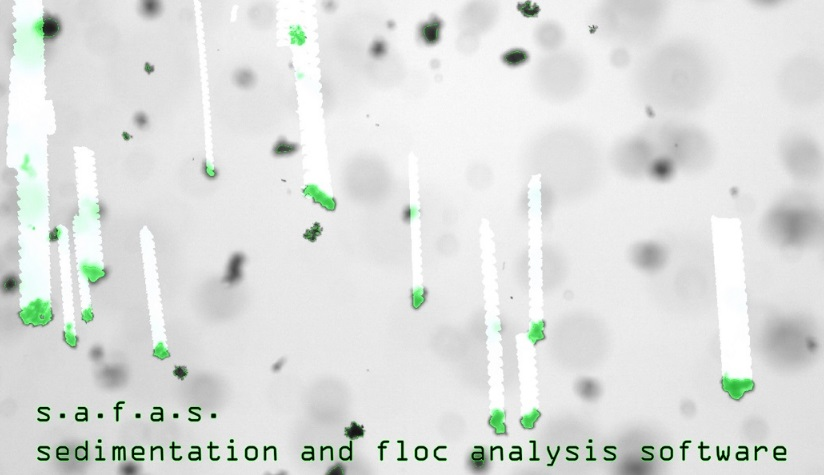

# SAFAS 

The latest version of SAFAS is a software to label and track objects in videos. This is the experimental version of SAFAS which will become v1.0.0 when it is released. At this time, the "plubming" is in place, but it has not been thoroughly tested so it is not ready for production use. 

Release TODO: 
* Update docs site
* Test workflow and calculations
* Package for distribution

# Overview
Safas is **s**edimentation **a**nd **f**loc **a**nalysis **s**oftware, a Python module for processing and interpretation of images and videos of flocs, a.k.a. aggregates, a.k.a. cohesive sediments.

This package permits the direct analysis of images and videos of flocs. Size, morphology and settling rate information may be measured from videos and saved in an easily accessible format.

Outdated documentation for the installation and use of SAFAS v0.1.0 software may be found here: https://safas.readthedocs.io/en/latest/ (to be updated with release of SAFAS v1.0.0

## Why Safas?
**Safas** is written in Python. It is open-source and the image filters are accessible and extensible. The image filters use functions from  and were designed and tested for segmenting and quantifying images of flocs.

* **"One-step" analysis.** The user can open a video file and directly process the frames. The results may exported to an .xlsx file in tabular format for analysis or reporting.

* **Optimized floc filters.** Image analysis can be challenging and each image class often requires a different treatment. The pre-defined filters are built on OpenCV and Scikit-Image and have been designed to work well with images of flocs.

* **GPU-enabled.** Several filters in Safas are GPU-enabled, through OpenCV with OpenCL, if the software environment is configured correctly during installation.
