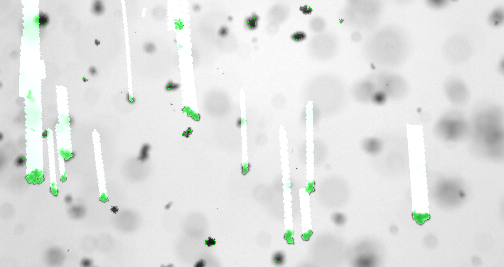

# Safas

Safas is **s**edimentation **a**nd **f**loc **a**nalysis **s**oftware, a Python module for processing and interpretation of images and videos of flocs, a.k.a. aggregates, a.k.a. cohesive sediments.

This package permits the direct analysis of images and videos of flocs. Size, morphology and settling rate information may be measured from videos and saved in an easily accessible format.

**Safas** has several features that make if useful for the analysis of floc images and video:

* **"One-step" analysis.** The user can open a video file and directly process the frames. The results may exported to an .xlsx file in tabular format for analysis or reporting.

* **Optimized floc filters.** Image analysis can be challenging and each image class often requires a different treatment. The pre-defined filters are built on OpenCV and Scikit-Image and have been designed to work well with images of flocs.

* **GUI.** Image processing and object tracking are done semi-interactively, which ensures the user has control over image segmentation and data analysis.

*Fig. 1: Floc tracking.*

*Fig. 2: Floc statistics.*
